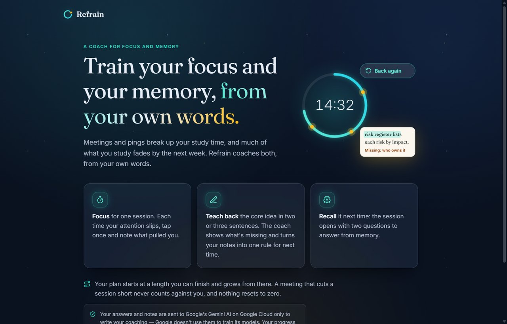
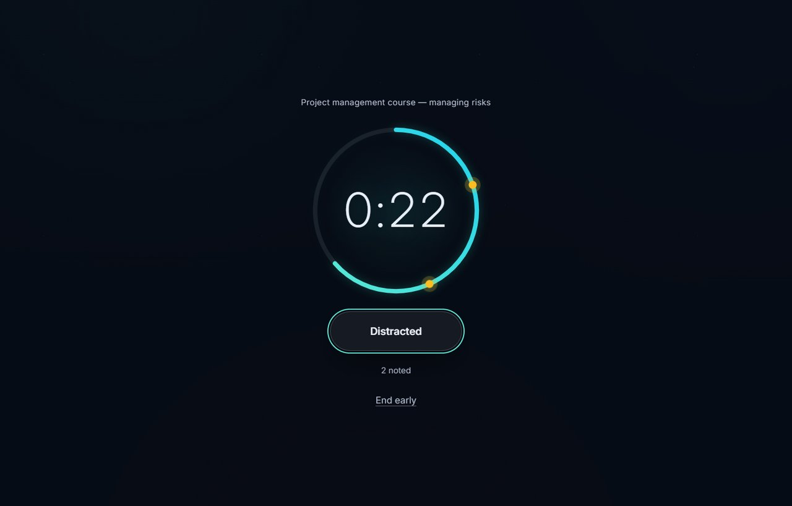
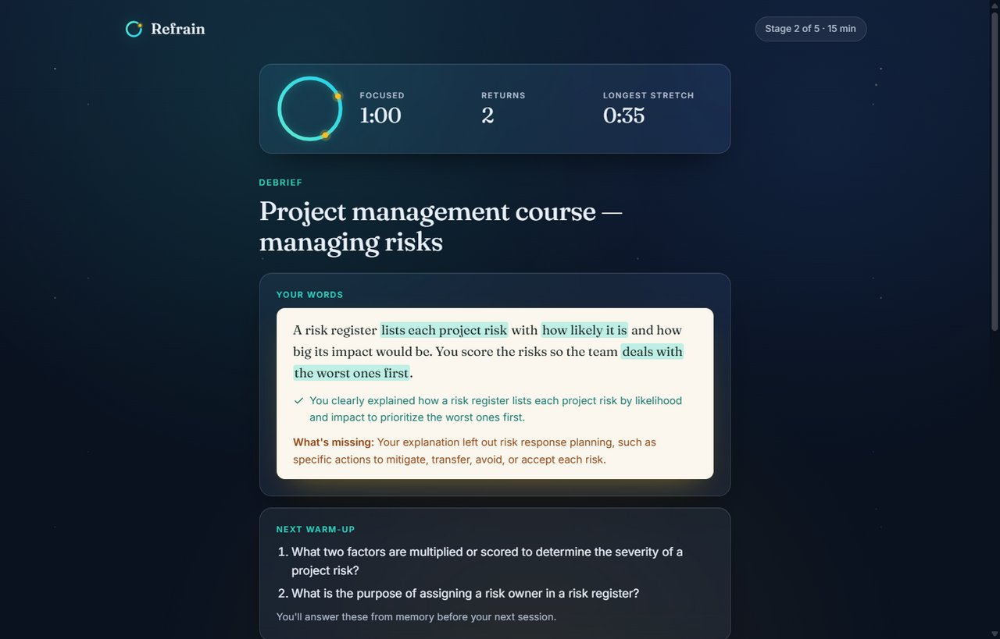
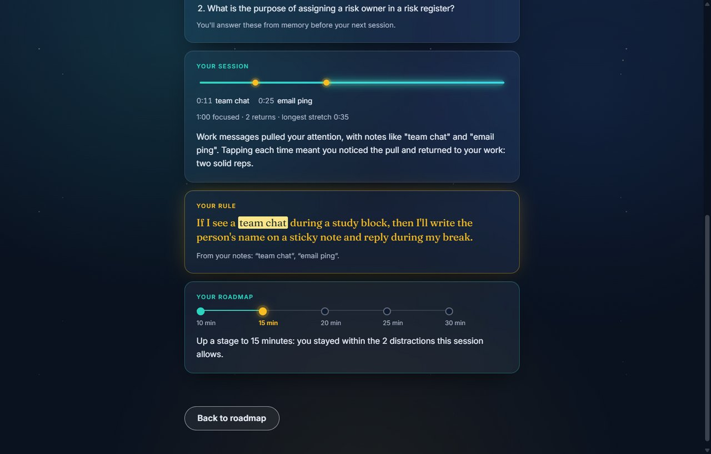
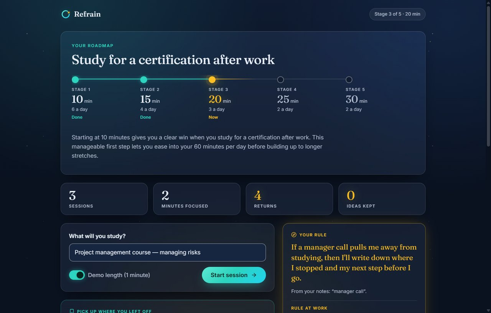
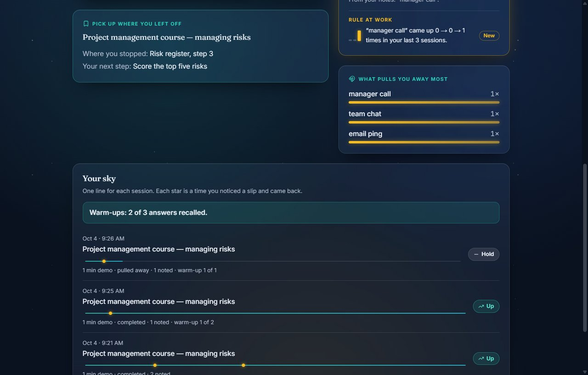

# Refrain

**An AI coach for focus and memory, for adults who study after work.**

Meetings and pings break up study time, and much of what you study fades by the next week. Refrain trains both in one study loop, and it coaches from your own words:

1. **Focus.** Run one session under a quiet night sky. A ring fills as the minutes pass, and each time your attention slips, you tap **Distracted** once and type what pulled you away ("team chat", "email ping"). A star lights on the ring: noticing and coming back is a rep, not a failure.
2. **Teach back.** Explain the core idea in two or three sentences. The coach marks what you got right in your own words, says what's missing, writes two questions for next time, and turns your distraction notes into one if-then rule ("If a team chat ping appears, then I'll note it and reply at the break.").
3. **Recall.** The next session opens with those questions, answered from memory and checked by the coach. A question you missed comes back at later warm-ups until you've recalled it twice.

Your plan starts at a session length you can finish and grows stage by stage. A meeting that cuts a session short (**I was pulled away**) holds your stage instead of counting against you, and a **Pick up where you left off** card brings back where you stopped. Home shows what the loop is doing for you: your totals, whether the pull behind your rule is shrinking, what pulls you away most, and one line of stars per session. Nothing resets to zero, and there are no streaks.

Refrain is for adults 18 and over.

**Try it:** https://refrain-476222056020.us-central1.run.app — kept online through the end of judging (October 30, 2026, 5 pm ET).

| | |
|---|---|
|  |  |
|  |  |
|  |  |

The screenshots come from the public link with the real coach.

### A two-minute tour

1. Watch the Welcome loop, then answer the four survey questions (for example 34, "Study for a certification after work", 60, 30) and read your roadmap and why it starts where it does.
2. On Home, switch on **Demo length (1 minute)**, type a topic, and start.
3. Tap **Distracted** twice, with the notes "team chat" and "email ping", and watch a star light on the ring each time. Let the minute end.
4. Explain the core idea in two sentences and read the debrief: your own words with what you got marked, what's missing, two questions for next time, the session as a line of stars, your rule, and the roadmap moving up.
5. **Start with warm-up**: answer one question from memory and leave one empty, **Check**, then **Start focusing**. Tap **Distracted** once to see your plan from the rule.
6. **End early** → **I was pulled away**, fill in where you stopped and your next step, and **Save and end**. The stage holds, and Home shows **Pick up where you left off**, your rule at work, and your sky. Next time, the question you missed comes back.

## Why it works this way

- **If-then plans** ("implementation intentions") have a medium-to-large effect on reaching goals (Gollwitzer & Sheeran 2006, [summary](https://goalsandprogress.com/implementation-intentions-gollwitzer-how-to)). The rule's then-part always names something to do instead, because "if …, then not …" plans can strengthen the habit they target (Adriaanse et al. 2011).
- **Retrieval beats re-reading.** After a week, people recalled 61% of a passage they had practised retrieving, versus 40% after re-studying it ([Roediger & Karpicke 2006](http://psychnet.wustl.edu/memory/wp-content/uploads/2018/04/Roediger-Karpicke-2006_PPS.pdf)); practice testing is rated "high utility" and rereading "low" ([Dunlosky et al. 2013](https://journals.sagepub.com/doi/abs/10.1177/1529100612453266)). That's why you explain and recall instead of reading an AI summary.
- **Missed ideas come back.** Dropping an item after one correct recall left people remembering about a third of it a week later, while repeated retrieval kept about 80% ([Karpicke & Roediger 2008](https://doi.org/10.1126/science.1152408)). So a missed question returns at the next warm-up, and one you got returns once more three sessions later.
- **Feedback about your own words.** Feedback helps more the more specific information it carries ([Wisniewski, Zierer & Hattie 2020](https://doi.org/10.3389/fpsyg.2019.03087)). The coach marks phrases copied exactly from what you wrote, and code checks that every marked phrase really is yours.
- **No streaks.** Missing one day "did not materially affect the habit formation process" ([Lally et al. 2010](https://onlinelibrary.wiley.com/doi/10.1002/ejsp.674)), so a missed day or an interruption never wipes out progress.
- **Generous distraction allowance.** Minds wander often during study ([review](https://pmc.ncbi.nlm.nih.gov/articles/PMC3730052)); a strict cap would teach people to stop tapping, so each session allows one tap per five minutes (at least two) before the stage holds.

## How it's built

- **Browser:** plain HTML, CSS, and JavaScript modules, with no build step. Progress (survey, roadmap, rule, history, questions to review) stays in this browser's `localStorage`; there are no accounts.
- **Design:** the "Night study" look, with glass cards over a faint aurora and long text on a lamp-lit page. The fonts and icons are served by the app itself, so the page makes no third-party requests, and a test checks every text and background colour pair against WCAG AA. The interface respects reduced motion, reduced transparency, more contrast, and forced colours.
- **Server:** Python 3.13 and Flask. Fixed rules in code decide every roadmap change, so the numbers are always exact and testable; the AI only writes words.
- **AI:** Gemini 3.8 Flash on Vertex AI (Google Cloud), with no API key. Each job — the roadmap, the warm-up check, and the debrief — is one stateless call that must answer in a JSON schema, is checked in code, and gets at most one retry. Google doesn't use this content to train its models.
- **Hosting:** Cloud Run, at most one instance, with 30 AI requests per visitor per hour and 360 Gemini calls per day. The logs hold token counts and costs, never what users typed.

Measured with real Gemini: about half a cent per session (a warm-up check and a debrief), and a median wait of 7 to 8 seconds for the debrief.

## Run it locally

You need Python 3.13, the [Google Cloud CLI](https://cloud.google.com/sdk/docs/install), and a Google Cloud project with the Vertex AI API turned on and billing linked.

```
python -m venv .venv
.venv\Scripts\activate            # macOS/Linux: source .venv/bin/activate
pip install -r requirements.txt -r requirements-dev.txt
gcloud auth application-default login
copy .env.example .env            # macOS/Linux: cp .env.example .env — then set your project ID
flask --app main run --port 8080
```

Open http://localhost:8080. To work on the interface without Google Cloud, set `REFRAIN_FAKE_AI=1` in `.env`: a simulated coach answers instantly, and every answer it gives is labelled **Simulated coach** on screen.

Tests use the simulated coach and make no AI calls:

```
pytest
node --test "tests/js/*.test.mjs"
```

The second line uses Node's built-in test runner (Node 22 or newer, no packages). It checks the interface's colour contrast against WCAG AA, using the colours in `static/css/styles.css`.

`python scripts/smoke_gemini.py` makes one real Gemini call and prints its tokens and estimated cost.

## Deploy to Cloud Run

From a project with Cloud Run, Vertex AI, Cloud Build, and Artifact Registry turned on, and a service account that holds only `roles/aiplatform.user`:

```
gcloud run deploy refrain --source . --region us-central1 --project YOUR_PROJECT ^
  --service-account refrain-run@YOUR_PROJECT.iam.gserviceaccount.com --allow-unauthenticated ^
  --max-instances 1 --concurrency 8 --memory 512Mi --timeout 60 ^
  --set-env-vars "GOOGLE_GENAI_USE_ENTERPRISE=true,GOOGLE_CLOUD_PROJECT=YOUR_PROJECT,GOOGLE_CLOUD_LOCATION=global" --quiet
```

(`^` continues a line in Windows `cmd`; use `\` in bash. In PowerShell, keep the `--set-env-vars` list in quotes, or PowerShell passes it to `gcloud` as one variable.) `.gcloudignore` keeps `.env`, the planning docs, and the tests out of the upload. The rate limits can be changed with `REFRAIN_RATE_PER_HOUR` and `REFRAIN_DAILY_CAP`.

**To stop all spending**, delete the service:

```
gcloud run services delete refrain --region us-central1 --project YOUR_PROJECT
```

## Planning documents

Refrain was planned and built with the Devpost **Build With AI: Basics** skill pack. The planning documents are in [`devpost/`](devpost/): [`scope.md`](devpost/scope.md) (the idea and what's in and out), [`prd.md`](devpost/prd.md) (every screen and behaviour), [`spec.md`](devpost/spec.md) (the technical design), [`checklist.md`](devpost/checklist.md) (the build, step by step, with every change of plan recorded), and [`app-map.html`](devpost/app-map.html) (a one-page map of how one action travels through the finished code).

## License

Refrain is released under the [MIT License](LICENSE). The fonts and icons it ships keep their own licenses, listed under Credits.

## Credits

- [Fraunces](https://fontsource.org/fonts/fraunces) (The Fraunces Project Authors) and [Inter](https://fontsource.org/fonts/inter) (The Inter Project Authors), under the SIL Open Font License 1.1; the licenses ship in [`static/licenses/`](static/licenses/).
- Icons from [Lucide](https://lucide.dev) (ISC license, some derived from Feather under MIT); the notice ships in [`static/licenses/Lucide-ISC.txt`](static/licenses/Lucide-ISC.txt).
- The coaching is written by Gemini 3.8 Flash on Google Cloud Vertex AI.
